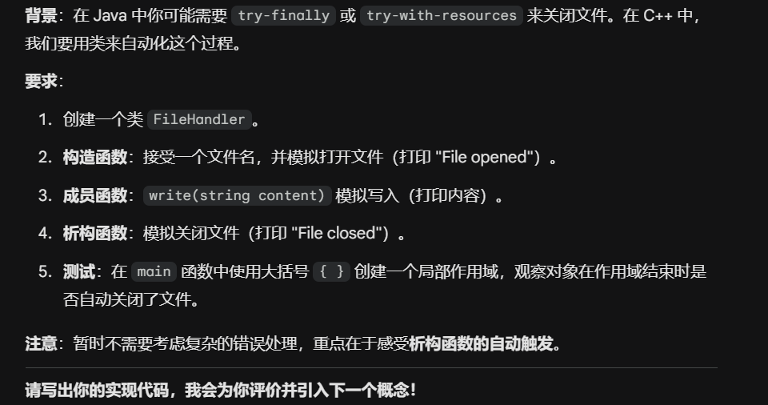

# My C++ Object-Oriented Journey 🚀

欢迎来到我的 C++ 面向对象（OOP）学习仓库。本项目记录了我从 Java 背景转型到 **现代 C++（Modern C++）** 的全过程，重点在于理解 C++ 的内存管理、RAII 机制以及设计模式的底层实践。

## 📌 学习目标
* **思维转换**：从 Java 的“全引用/GC 模式”切换到 C++ 的“值语义/手动控制模式”。
* **核心掌握**：RAII、拷贝控制（Rule of Three/Five）、智能指针、多态底层原理（Vtable）。
* **工程实践**：遵循 Google C++ Style Guide，编写健壮、高效、可维护的 C++ 代码。

---

## 🛠 项目一：FileHandler - RAII 资源管理实践



### 1. 核心概念
* **RAII (Resource Acquisition Is Initialization)**：利用栈对象的生命周期自动化管理资源。
* **分离编译**：实现 `.h` 接口与 `.cpp` 实现的分离，理解 C++ 编译链路。
* **值语义 (Value Semantics)**：理解为什么在 C++ 中不应滥用 `new`，以及大括号 `{}` 对对象销毁的精确控制。

### 2. 技术要点
* **初始化列表**：在构造函数中使用 `: member_(value)` 进行高效初始化。
* **常量引用**：使用 `const std::string&` 传递参数，平衡右值兼容性与内存性能。
* **拷贝控制**：理解浅拷贝（Shallow Copy）风险，并学习使用 `delete` 关键字禁用危险的拷贝行为。

### 3. 代码结构
```text
.
├── main.cpp          # 测试用例，验证栈对象的析构时机
├── FileHandler.h     # 类接口声明，包含头文件保护符
└── FileHandler.cpp   # 类成员函数实现
```

---

## 📈 进度记录
- [x] **Phase 1**: 内存布局、构造/析构与 RAII 基础 (当前进度)
- [ ] **Phase 2**: 拷贝构造函数与赋值运算符重写 (Deep Copy vs Shallow Copy)
- [ ] **Phase 3**: 虚函数、纯虚函数与接口设计
- [ ] **Phase 4**: 现代 C++ 智能指针 (Unique/Shared/Weak Ptr)
- [ ] **Phase 5**: 常用设计模式 C++ 实现 (工厂、单例、策略等)

---

### 如何运行
1. 确保编译器支持 **C++11** 或更高版本。
2. 推荐使用 Dev-C++ 或 VS Code 进行编译。
3. 编译命令：`g++ main.cpp FileHandler.cpp -o main -std=c++11`

---
